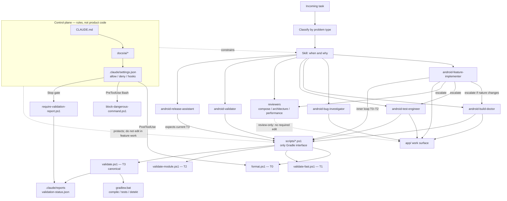

# Android AI engineering harness

This repository is an Android workspace with a **Claude-oriented AI harness**: specialized agents, skills, scripts, and a protected control plane. The app under `app/` is the work surface. The harness is the system that decides *how* work is done, *who* does it, and *when* it is complete.

The goal is daily Android delivery that stays small, reviewable, and evidence-based. No meaningful production change is complete without canonical validation.

## Why this architecture exists

A generic coding assistant tends to mix jobs that should stay separate: implement a feature, debug Gradle, rewrite tests, and claim “done” from a fast compile.

This harness splits those jobs on purpose:

- **Route by problem type**, not by convenience.
- **Keep changes small** and aligned with existing architecture.
- **Validate in tiers** during work; **gate completion** with one canonical path.
- **Protect the harness itself** so feature work cannot rewrite the rules.

## Architecture diagram

The control plane wraps every session. A skill picks an agent. Agents change `app/` or review it. Only scripts talk to Gradle and write reports. Hooks enforce format, block unsafe Bash, and require a passing canonical report at stop when production files changed.



Read the diagram left-to-right as policy → routing → work → evidence. Review-only paths skip code edits and skip T3 unless production files change.

## Four layers

### 1. Control plane (rules)

Defines constraints, permissions, and what “complete” means. Agents execute inside this box. They do not own the box.

| Piece | Role |
| --- | --- |
| `CLAUDE.md` | Top-level contract. Wins on conflict unless it delegates. |
| `docs/ai/operating-model.md` | Structure, lifecycle, escalation, completion. |
| `docs/ai/task-routing.md` | Task class → agent and expected validation path. |
| `docs/ai/validation-tiers.md` | Tier 0–3 usage and artifacts. |
| `.claude/settings.json` | Allowed/denied tools, hooks (format, dangerous-command block, stop-time validation gate). |

### 2. Skills (when and why)

Skills are the **entry point**. Each skill names a workflow and which agent should run it.

| Skill | Agent |
| --- | --- |
| `implement-feature` | `android-feature-implementer` |
| `fix-build` | `android-build-doctor` |
| `fix-test-failures` | `android-test-engineer` |
| `review-compose-screen` | `android-compose-reviewer` |
| `review-architecture` | `android-architecture-reviewer` |
| `investigate-performance` | `android-performance-reviewer` |
| `run-android-validation` | `android-validator` |
| `prepare-release` / `finalize-change` | `android-release-assistant` |

### 3. Agents (how)

Agents are **narrow roles**. They do not decide the product goal. They execute one class of work with a defined mission and output.

| Agent | Job |
| --- | --- |
| `android-feature-implementer` | Smallest viable feature change |
| `android-bug-investigator` | Reproduce and repair broken behavior |
| `android-build-doctor` | Gradle, SDK, KSP, environment, validation pipeline |
| `android-test-engineer` | Add or repair tests |
| `android-compose-reviewer` | Compose state, side effects, recomposition |
| `android-architecture-reviewer` | Ownership, boundaries, coupling |
| `android-performance-reviewer` | Startup, main thread, repeated work |
| `android-validator` | Run canonical validation; do not change production code |
| `android-release-assistant` | Final readiness / human handoff |

Escalate when the *nature* of the work changes (for example implementer → build doctor when Gradle is the blocker). Do not stretch one agent across unrelated jobs.

### 4. Scripts (execution)

Scripts are the **only public interface** to Gradle, safety checks, and validation reports. Direct `gradlew` is not the completion path.

| Script | Role |
| --- | --- |
| `scripts/format.ps1` | Tier 0 hygiene (also a PostToolUse hook) |
| `scripts/validate-fast.ps1` | Tier 1 inner-loop compile confidence |
| `scripts/validate-module.ps1` | Tier 2 module compile / tests / Detekt |
| `scripts/validate.ps1` | **Tier 3 canonical** compile, unit tests, Detekt |
| `scripts/require-validation-report.ps1` | Stop-time gate: report must exist, be current, and PASS when production files changed |
| `scripts/block-dangerous-command.ps1` | PreToolUse Bash guard |
| `scripts/write-validation-report.ps1` | Report writer used by `validate.ps1` only |
| `scripts/ensure-claude-dirs.ps1` | Report directory setup |

Run on Windows-native PowerShell:

```powershell
powershell -ExecutionPolicy Bypass -Command "& .\scripts\validate.ps1"
```

## Execution lifecycle

1. Understand the task and classify it (feature, bug, build, test, review, release).
2. Route to the matching skill/agent.
3. Apply the smallest change that matches local patterns.
4. Validate incrementally (tiers 0–2).
5. Run `validate.ps1` before claiming production-relevant completion.
6. Hand off: what changed, validation evidence, risks, recommendation.

Review-only, diagnosis-only, and analysis-only sessions do not need canonical validation if they change no production-relevant files.

## Validation contract

| Tier | Script | Proves | Completes a task? |
| --- | --- | --- | --- |
| 0 | `format.ps1` | Formatting | No |
| 1 | `validate-fast.ps1` | Fast compile | No |
| 2 | `validate-module.ps1` | Module surface | No |
| 3 | `validate.ps1` | Compile + unit tests + Detekt, no cache | **Yes** (when production-relevant) |

Canonical artifacts (written only by `validate.ps1`):

- `.claude/reports/validation-status.json`
- `.claude/reports/validation-raw.log`

Minimum Gradle work inside canonical validation:

- `:app:compileDebugKotlin`
- `:app:testDebugUnitTest`
- `:app:detekt`

Each with `--rerun-tasks --no-build-cache --console=plain`.

Production-relevant paths include at least `app/**`, `config/**`, `build.gradle.kts`, `settings.gradle.kts`, `gradle.properties`, and `local.properties`.

## Control plane protection

Normal feature, bug, and test work **must not** edit:

- `CLAUDE.md`
- `.claude/settings.json`, `.claude/settings.local.json`
- `.claude/agents/**`, `.claude/skills/**`, `.claude/reports/**`
- `scripts/validate.ps1`, `require-validation-report.ps1`, `write-validation-report.ps1`, `block-dangerous-command.ps1`, `ensure-claude-dirs.ps1`

Changing those files is a **harness-maintenance** task: explicit, isolated, intentional.

Permissions in `.claude/settings.json` encode the same idea: app and docs are writable; harness files and raw Gradle are denied. Hooks format after edits, block dangerous Bash, and require a passing canonical report at stop when the session changed production code.

## Anti-patterns

- Using the implementer to fix a Gradle failure.
- Claiming done from `validate-fast.ps1` or `validate-module.ps1`.
- Broad refactors when a local fix is enough.
- Editing control-plane files during product work.
- Hand-writing or substituting `validation-status.json`.

## Where to read next

1. `CLAUDE.md` — operating contract
2. `docs/ai/operating-model.md` — system design
3. `docs/ai/task-routing.md` — routing table
4. `docs/ai/validation-tiers.md` — validation details
5. `.claude/agents/` and `.claude/skills/` — role and workflow definitions
